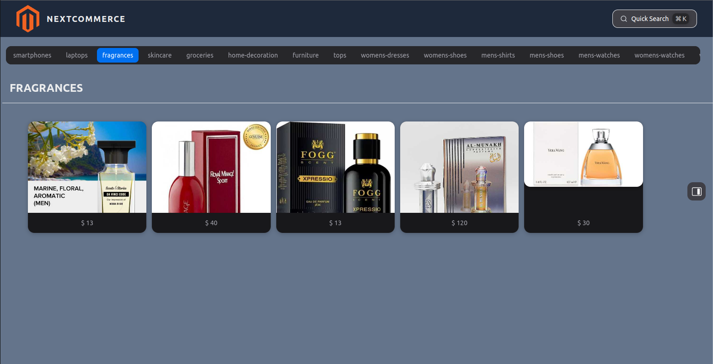
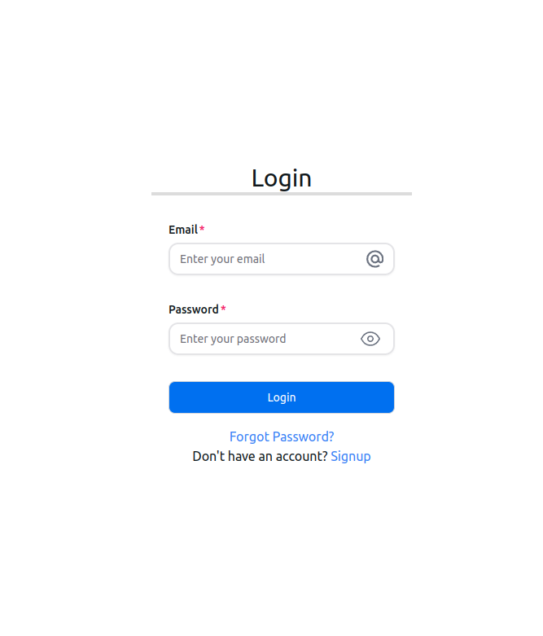
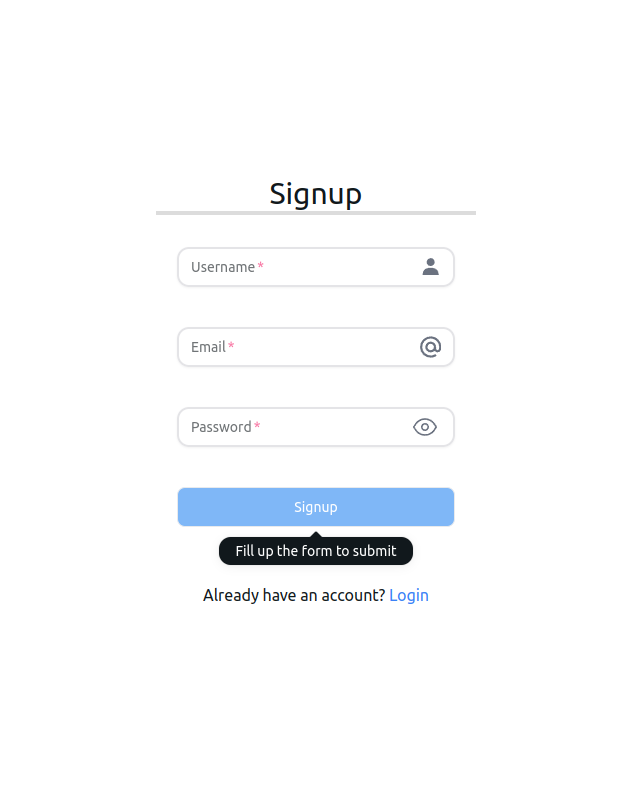
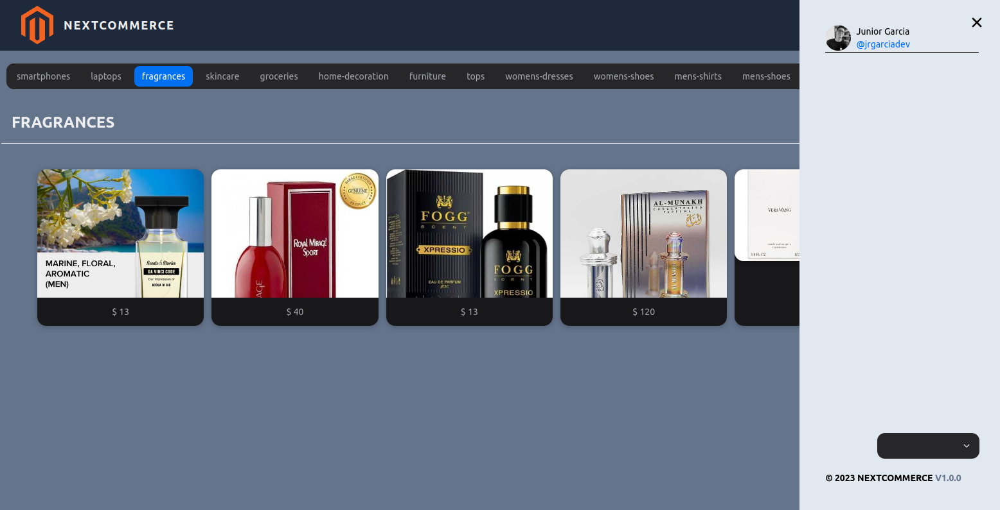

<!-- write a README about the NEXTCOMMERCE site by scanning the code base -->

# NEXTCOMMERCE

## Description

NEXTCOMMERCE is a full stack e-commerce application that allows users to create an account, browse products, add products to a cart, and checkout. The application is built with React, Redux, Node, Express, and MongoDB.

## Table of Contents

- [NEXTCOMMERCE](#nextcommerce)
  - [Description](#description)
  - [Table of Contents](#table-of-contents)
  - [Installation](#installation)
  - [Usage](#usage)
  - [License](#license)
  - [Questions](#questions)
  - [Contributing](#contributing)
  - [Tests](#tests)
  - [Technologies](#technologies)
  - [Links](#links)
  - [Screenshots](#screenshots)
  - [Credits](#credits)
  - [Contact](#contact)
  - [Badges](#badges)
  - [Features](#features)
  - [Contributions](#contributions)
  - [Show your support](#show-your-support)

## Installation

To install the application locally, clone the repository and run `npm install` to install dependencies. Then, run `npm start` to start the server.

## Usage

To use the application, visit the deployed site at [NEXTCOMMERCE](https://nextcommerce.herokuapp.com/). To use the application locally, run `npm start` to start the server and visit `localhost:3000` in your browser.

## License

This application is covered under the MIT license.

## Questions

For any questions, contact me at [Gowtham's GitHub](https://github.com/VGowthamTheja) or email me at [my email](mailto:vempalligowthamtheja@gmail.com).

## Contributing

To contribute to the application, create an issue or a pull request.

## Tests

To test the application, run `npm test`.

## Technologies

- NextJS
- MySQL
- Prisma
- Tailwind CSS
- React
  
## Links

- [Deployed Application](https://nextcommerce.herokuapp.com/)
- [GitHub Repository](https://github.com/VGowthamTheja/ecommerce-with-nextjs)

## Screenshots

## Credits

- [React](https://reactjs.org/)
- [NextJS](https://nextjs.org/)
- [Tailwind CSS](https://tailwindcss.com/)
- [Prisma](https://www.prisma.io/)
- [MySQL](https://www.mysql.com/)
- [Vercel](https://vercel.com/)

## Contact

Contact me at [My GitHub](https://github.com/VGowthamTheja/ecommerce-with-nextjs) or [My Email](mailto:vempalligowthamtheja@gmail.com)

## Badges

## Features

- [x] Authentication
- [ ] Product Search
- [ ] Product Filtering
- [ ] Cart
- [ ] Cart Checkout
- [ ] Order History
- [ ] Product Reviews
- [ ] Product Ratings
- [ ] Product Recommendations
- [x] Product Categories
- [ ] Product Tags
- [x] Product Sorting
- [ ] Product Pagination

## Contributions

Contributions, issues and feature requests are welcome.

## Show your support

Give a ⭐️ if this project helped you!

***
